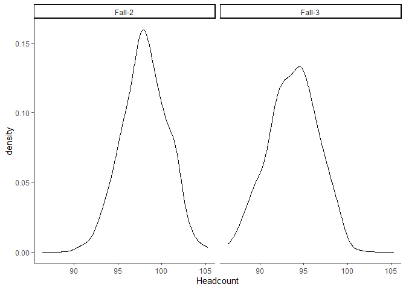

Student Forecast Simulation
================

## Describe a model:

The next step is to simulate the chances of moving on.

<!--html_preserve-->

<table class="gt_table">

<thead class="gt_header">

<tr>

<th colspan="7" class="gt_heading gt_title gt_font_normal" style>

Student-level data example

</th>

</tr>

<tr>

<th colspan="7" class="gt_heading gt_subtitle gt_font_normal gt_bottom_border" style>

</th>

</tr>

</thead>

<thead class="gt_col_headings">

<tr>

<th class="gt_col_heading gt_columns_bottom_border gt_right" rowspan="1" colspan="1">

Id

</th>

<th class="gt_col_heading gt_columns_bottom_border gt_left" rowspan="1" colspan="1">

Semester

</th>

<th class="gt_col_heading gt_columns_bottom_border gt_center" rowspan="1" colspan="1">

NumberSemester

</th>

<th class="gt_col_heading gt_columns_bottom_border gt_right" rowspan="1" colspan="1">

ProbOfMovingOn

</th>

<th class="gt_col_heading gt_columns_bottom_border gt_right" rowspan="1" colspan="1">

MovedOn

</th>

<th class="gt_col_heading gt_columns_bottom_border gt_left" rowspan="1" colspan="1">

CurrentSemester

</th>

<th class="gt_col_heading gt_columns_bottom_border gt_left" rowspan="1" colspan="1">

FutureSemester

</th>

</tr>

</thead>

<tbody class="gt_table_body">

<tr>

<td class="gt_row gt_right">

1

</td>

<td class="gt_row gt_left">

F

</td>

<td class="gt_row gt_center">

1

</td>

<td class="gt_row gt_right">

0.114

</td>

<td class="gt_row gt_right">

1

</td>

<td class="gt_row gt_left">

F1

</td>

<td class="gt_row gt_left">

W1

</td>

</tr>

<tr>

<td class="gt_row gt_right">

1

</td>

<td class="gt_row gt_left">

W

</td>

<td class="gt_row gt_center">

1

</td>

<td class="gt_row gt_right">

0.622

</td>

<td class="gt_row gt_right">

1

</td>

<td class="gt_row gt_left">

W1

</td>

<td class="gt_row gt_left">

F2

</td>

</tr>

<tr>

<td class="gt_row gt_right">

1

</td>

<td class="gt_row gt_left">

F

</td>

<td class="gt_row gt_center">

2

</td>

<td class="gt_row gt_right">

0.609

</td>

<td class="gt_row gt_right">

1

</td>

<td class="gt_row gt_left">

F2

</td>

<td class="gt_row gt_left">

W2

</td>

</tr>

<tr>

<td class="gt_row gt_right">

1

</td>

<td class="gt_row gt_left">

W

</td>

<td class="gt_row gt_center">

2

</td>

<td class="gt_row gt_right">

0.623

</td>

<td class="gt_row gt_right">

1

</td>

<td class="gt_row gt_left">

W2

</td>

<td class="gt_row gt_left">

F3

</td>

</tr>

<tr>

<td class="gt_row gt_right">

1

</td>

<td class="gt_row gt_left">

F

</td>

<td class="gt_row gt_center">

3

</td>

<td class="gt_row gt_right">

0.861

</td>

<td class="gt_row gt_right">

1

</td>

<td class="gt_row gt_left">

F3

</td>

<td class="gt_row gt_left">

W3

</td>

</tr>

<tr>

<td class="gt_row gt_right">

1

</td>

<td class="gt_row gt_left">

W

</td>

<td class="gt_row gt_center">

3

</td>

<td class="gt_row gt_right">

0.640

</td>

<td class="gt_row gt_right">

1

</td>

<td class="gt_row gt_left">

W3

</td>

<td class="gt_row gt_left">

Leave

</td>

</tr>

</tbody>

</table>

<!--/html_preserve-->

The table below shows the transition matrix for the one hunderd students
example.

<!--html_preserve-->

<table class="gt_table">

<thead class="gt_header">

<tr>

<th colspan="11" class="gt_heading gt_title gt_font_normal" style>

Transition Matrix

</th>

</tr>

<tr>

<th colspan="11" class="gt_heading gt_subtitle gt_font_normal gt_bottom_border" style>

</th>

</tr>

</thead>

<thead class="gt_col_headings">

<tr>

<th class="gt_col_heading gt_center gt_columns_bottom_border" rowspan="2" colspan="1">

CurrentSemester

</th>

<th class="gt_center gt_columns_top_border gt_column_spanner_outer" rowspan="1" colspan="10">

Following Semester

</th>

</tr>

<tr>

<th class="gt_col_heading gt_columns_bottom_border gt_center" rowspan="1" colspan="1">

F2

</th>

<th class="gt_col_heading gt_columns_bottom_border gt_center" rowspan="1" colspan="1">

F3

</th>

<th class="gt_col_heading gt_columns_bottom_border gt_center" rowspan="1" colspan="1">

F4

</th>

<th class="gt_col_heading gt_columns_bottom_border gt_center" rowspan="1" colspan="1">

Graduated

</th>

<th class="gt_col_heading gt_columns_bottom_border gt_center" rowspan="1" colspan="1">

Leave

</th>

<th class="gt_col_heading gt_columns_bottom_border gt_center" rowspan="1" colspan="1">

Not graduated

</th>

<th class="gt_col_heading gt_columns_bottom_border gt_center" rowspan="1" colspan="1">

W1

</th>

<th class="gt_col_heading gt_columns_bottom_border gt_center" rowspan="1" colspan="1">

W2

</th>

<th class="gt_col_heading gt_columns_bottom_border gt_center" rowspan="1" colspan="1">

W3

</th>

<th class="gt_col_heading gt_columns_bottom_border gt_center" rowspan="1" colspan="1">

W4

</th>

</tr>

</thead>

<tbody class="gt_table_body">

<tr>

<td class="gt_row gt_left">

F1

</td>

<td class="gt_row gt_right">

0.000

</td>

<td class="gt_row gt_right">

0.000

</td>

<td class="gt_row gt_right">

0.000

</td>

<td class="gt_row gt_right">

0.000

</td>

<td class="gt_row gt_right">

0.098

</td>

<td class="gt_row gt_right">

0.000

</td>

<td class="gt_row gt_right">

0.902

</td>

<td class="gt_row gt_right">

0.000

</td>

<td class="gt_row gt_right">

0.000

</td>

<td class="gt_row gt_right">

0.000

</td>

</tr>

<tr>

<td class="gt_row gt_left">

F2

</td>

<td class="gt_row gt_right">

0.000

</td>

<td class="gt_row gt_right">

0.000

</td>

<td class="gt_row gt_right">

0.000

</td>

<td class="gt_row gt_right">

0.000

</td>

<td class="gt_row gt_right">

0.053

</td>

<td class="gt_row gt_right">

0.000

</td>

<td class="gt_row gt_right">

0.000

</td>

<td class="gt_row gt_right">

0.947

</td>

<td class="gt_row gt_right">

0.000

</td>

<td class="gt_row gt_right">

0.000

</td>

</tr>

<tr>

<td class="gt_row gt_left">

F3

</td>

<td class="gt_row gt_right">

0.000

</td>

<td class="gt_row gt_right">

0.000

</td>

<td class="gt_row gt_right">

0.000

</td>

<td class="gt_row gt_right">

0.000

</td>

<td class="gt_row gt_right">

0.172

</td>

<td class="gt_row gt_right">

0.000

</td>

<td class="gt_row gt_right">

0.000

</td>

<td class="gt_row gt_right">

0.000

</td>

<td class="gt_row gt_right">

0.828

</td>

<td class="gt_row gt_right">

0.000

</td>

</tr>

<tr>

<td class="gt_row gt_left">

F4

</td>

<td class="gt_row gt_right">

0.000

</td>

<td class="gt_row gt_right">

0.000

</td>

<td class="gt_row gt_right">

0.000

</td>

<td class="gt_row gt_right">

0.000

</td>

<td class="gt_row gt_right">

0.099

</td>

<td class="gt_row gt_right">

0.000

</td>

<td class="gt_row gt_right">

0.000

</td>

<td class="gt_row gt_right">

0.000

</td>

<td class="gt_row gt_right">

0.000

</td>

<td class="gt_row gt_right">

0.901

</td>

</tr>

<tr>

<td class="gt_row gt_left">

Leave

</td>

<td class="gt_row gt_right">

0.127

</td>

<td class="gt_row gt_right">

0.042

</td>

<td class="gt_row gt_right">

0.197

</td>

<td class="gt_row gt_right">

0.099

</td>

<td class="gt_row gt_right">

0.085

</td>

<td class="gt_row gt_right">

0.056

</td>

<td class="gt_row gt_right">

0.113

</td>

<td class="gt_row gt_right">

0.085

</td>

<td class="gt_row gt_right">

0.099

</td>

<td class="gt_row gt_right">

0.099

</td>

</tr>

<tr>

<td class="gt_row gt_left">

W1

</td>

<td class="gt_row gt_right">

0.934

</td>

<td class="gt_row gt_right">

0.000

</td>

<td class="gt_row gt_right">

0.000

</td>

<td class="gt_row gt_right">

0.000

</td>

<td class="gt_row gt_right">

0.066

</td>

<td class="gt_row gt_right">

0.000

</td>

<td class="gt_row gt_right">

0.000

</td>

<td class="gt_row gt_right">

0.000

</td>

<td class="gt_row gt_right">

0.000

</td>

<td class="gt_row gt_right">

0.000

</td>

</tr>

<tr>

<td class="gt_row gt_left">

W2

</td>

<td class="gt_row gt_right">

0.000

</td>

<td class="gt_row gt_right">

0.947

</td>

<td class="gt_row gt_right">

0.000

</td>

<td class="gt_row gt_right">

0.000

</td>

<td class="gt_row gt_right">

0.053

</td>

<td class="gt_row gt_right">

0.000

</td>

<td class="gt_row gt_right">

0.000

</td>

<td class="gt_row gt_right">

0.000

</td>

<td class="gt_row gt_right">

0.000

</td>

<td class="gt_row gt_right">

0.000

</td>

</tr>

<tr>

<td class="gt_row gt_left">

W3

</td>

<td class="gt_row gt_right">

0.000

</td>

<td class="gt_row gt_right">

0.000

</td>

<td class="gt_row gt_right">

0.917

</td>

<td class="gt_row gt_right">

0.000

</td>

<td class="gt_row gt_right">

0.083

</td>

<td class="gt_row gt_right">

0.000

</td>

<td class="gt_row gt_right">

0.000

</td>

<td class="gt_row gt_right">

0.000

</td>

<td class="gt_row gt_right">

0.000

</td>

<td class="gt_row gt_right">

0.000

</td>

</tr>

<tr>

<td class="gt_row gt_left">

W4

</td>

<td class="gt_row gt_right">

0.000

</td>

<td class="gt_row gt_right">

0.000

</td>

<td class="gt_row gt_right">

0.000

</td>

<td class="gt_row gt_right">

0.820

</td>

<td class="gt_row gt_right">

0.000

</td>

<td class="gt_row gt_right">

0.180

</td>

<td class="gt_row gt_right">

0.000

</td>

<td class="gt_row gt_right">

0.000

</td>

<td class="gt_row gt_right">

0.000

</td>

<td class="gt_row gt_right">

0.000

</td>

</tr>

</tbody>

</table>

<!--/html_preserve-->

<!-- -->
